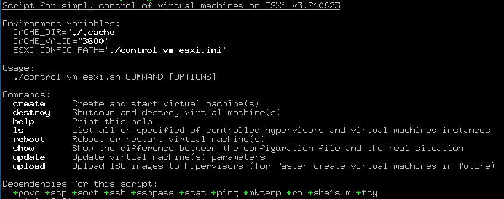

# Скрипты для работы с diskless-нодами на ESXi

Коллекция `BASH`-скриптов для работы с `diskless`-нодами под управлением `VmWare ESXi` гипервизоров.



### Возможности:

* Описание конфигурации через `INI`-файлы;
* Корректная обработка ошибок и исключительных ситуаций на каждом этапе;
* Цветное оформления для лучшей читабельности вывода скриптов;
* Загрузка виртуальных машин через собранные `ISO`-образы (шаблоны) при полном размещении ОС в оперативной памяти;
* Сборка `ISO`-образов (шаблонов) на основе базового слоя выбранной операционной системы;
* Преподготовленный базовый слой `ubuntu-xenial-amd64-minbase`;
* Модификация базового слоя под конкретное применение через обычные скрипты в `GIT`-репозитарии;
* Предварительная (или по команде) загрузка `ISO`-образов (шаблонов) на гипервизоры с выводом отдельного статуса по ним;
* Поддержка обработки нескольких виртуальных машин за один запуск с выводом статуса по каждой из них;
* Создание виртуальных машин с возможностью удаления одноименной на другом гипервизоре (аналог миграции)
  и/или пересоздания уже существующих виртуальных машин;
* Уничтожение и перезагрузка виртуальных машин, в том числе и не указанных в конфигурационном файле;
* Поддержка запуска различных вспомогательных скриптов (хуков);
* Отображение различий настроек в конфигурационном файле и на гипервизорах;
* Поддержка переключения `ISO`-образа виртуальной машины на лету (для будущей перезагрузки);
* Проверка контрольных сумм артефактов базовых слоёв при создании образов, а также контрольных сумм ISO-образов
  при создании виртуальных машин;

### Содержимое:

```
├ base_layers/ubuntu-xenial-amd64-minbase - базовый слой с Ubuntu Xenial для amd64-платформы в minbase варианте
├ hooks/                                  - папка для расположения вспомогательных скриптов (хуков)
├ isolinux/                               - файлы из isolinux-проекта для возможности сборки загрузочных ISO-образов (шаблонов)
├ Dockerfile                              - файл для docker для запуска скриптов в контейнере
├ build_iso_images.sh                     - скрипт для сборки загрузочных ISO-образов (шаблонов) с нуля
├ build_iso_images.ini.example            - пример конфигурационного файла
├ control_vm_esxi.sh                      - скрипт для управления diskless-виртуальным машинами на Vmware ESXi гипервизорах
├ control_vm_esxi.ini.example             - пример конфигурационного файла
├ functions.sh.inc                        - файл со вспомогательными общими функциями
```

### Системные требования:

* base_layers/ubuntu-xenial-amd64-minbase:
  * **debootstrap**
  * **mkpasswd** (идёт в составе `whois` пакета)
  * **squashfs-tools**
* build_iso_images.sh:
  * **genisoimage** (может быть отдельным пакетом или в составе `cdrkit` или `wodim` пакетов)
  * **git**
* control_vm_esxi.sh:
  * **govc** (из состава [gomomi](https://github.com/vmware/govmomi) проекта)
  * **openssh**
  * **sshpass**

### Запуск в **Docker**:

Для запуска скриптов в Docker можно использовать следующую последовательность команд:

1. Сборка `docker`-образа:
```bash
$ docker build -t esxi-diskless .
```
2. Команда для запуска **build_iso_images.sh** скрипта:
```bash
$ docker run --rm -v /proc:/proc -v `pwd`:/build --cap-add=SYS_ADMIN esxi-diskless ./build_iso_images.sh
```
3. Команда для запуска **control_vm_esxi.sh** скрипта:
```bash
$ docker run --rm -v `pwd`:/build esxi-diskless ./control_vm_esxi.sh
```

### Полная документация

* [По скрипту `build_iso_images.sh`](docs/BUILD_ISO_IMAGES.md)
* [По скрипту `control_vm_esxi.sh`](docs/CONTROL_VM_ESXI.md)
