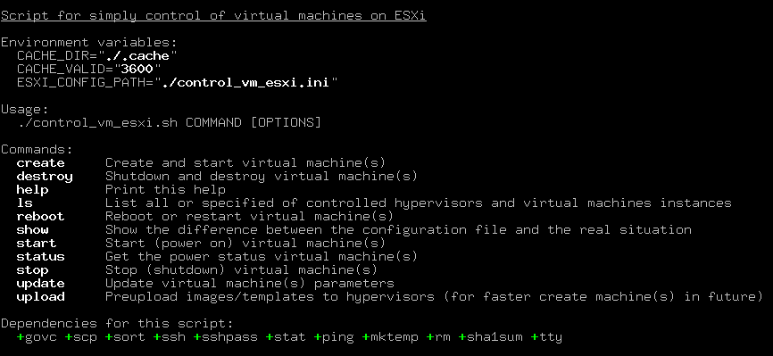

# Скрипты для работы с disk(less)-нодами на ESXi

Коллекция `BASH`-скриптов для работы с `disk(less)`-нодами под управлением `VmWare ESXi` гипервизоров.



### Содержание

* [Возможности](#возможности)
* [Содержимое](#содержимое)
* [Полная документация](#полная-документация)
* [Системные требования](#системные-требования)
* [Запуск в **Docker**](#запуск-в-docker)

### Возможности

* Описание конфигурации через `INI`-файлы;
* Корректная обработка ошибок и исключительных ситуаций на каждом этапе;
* Цветное оформления для лучшей читабельности вывода скриптов;
* Поддержка работы с 4мя типами виртуальных машин: бездисковые (на базе подготовленного `ISO`-образа с полным
  размещением ОС в оперативной памяти), бездисковые с диском для хранения данных, дисковые (на базе подготовленного
  `HDD`-шаблона), сетевые (с загрузкой только по сети);
* Поддержка сборки `ISO`-образов на основе базового слоя выбранной операционной системы и его модификации
  под конкретное применение через обычные скрипты в `GIT`-репозитарии;
* Преподготовленный базовый слой `ubuntu-xenial-amd64-minbase`;
* Предварительная (или по команде) загрузка `ISO`-образов и `HDD`-шаблонов на гипервизоры
  с выводом отдельного статуса по ним;
* Проверка контрольных сумм артефактов базовых слоёв при создании `ISO`-образов,
  а также контрольных сумм `ISO`-образов и `HDD`-шаблонов при создании виртуальных машин;
* Поддержка обработки нескольких виртуальных машин за один запуск с выводом статуса по каждой из них;
* Создание виртуальных машин с возможностью удаления одноименной на другом гипервизоре (аналог миграции)
  и/или пересоздания уже существующих виртуальных машин;
* Уничтожение, включение, выключение, перезагрузка, получение статуса питания виртуальных машин, в том числе
  и не указанных в конфигурационном файле;
* Получение статуса питания виртуальных машин;
* Управлением VNC-доступом к виртуальным машинам;
* Автоматическое включение менеджера автостарта виртуальных машин в гипервизоре, если это необходимо;
* Поддержка запуска различных вспомогательных скриптов (хуков);
* Отображение различий настроек в конфигурационном файле и на гипервизорах;
* Поддержка переключения `ISO`-образа виртуальной машины на лету (для будущей перезагрузки);
* Поддержка отложенного обновления некоторых параметров виртуальных машин (временная зона, адреса DNS-серверов);

### Содержимое

```
├ base_layers/ubuntu-xenial-amd64-minbase - базовый слой с Ubuntu Xenial для amd64-платформы в minbase варианте
├ hooks/                                  - папка для расположения вспомогательных скриптов (хуков)
├ isolinux/                               - файлы из isolinux-проекта для возможности сборки загрузочных ISO-образов
├ Dockerfile                              - файл для docker для запуска скриптов в контейнере
├ build_iso_images.sh                     - скрипт для сборки загрузочных ISO-образов с нуля
├ build_iso_images.ini.example            - пример конфигурационного файла
├ control_vm_esxi.sh                      - скрипт для управления diskless-виртуальным машинами на Vmware ESXi гипервизорах
├ control_vm_esxi.ini.example             - пример конфигурационного файла
├ functions.sh.inc                        - файл со вспомогательными общими функциями
```

### Полная документация

* [По скрипту `build_iso_images.sh`](docs/BUILD_ISO_IMAGES.md)
* [По скрипту `control_vm_esxi.sh`](docs/CONTROL_VM_ESXI.md)
* [Примеры использования](docs/EXAMPLES.md)
* [Список изменений](CHANGELOG.md)

### Системные требования

* base_layers/ubuntu-xenial-amd64-minbase:
  * **debootstrap**
  * **mkpasswd** (идёт в составе `whois` пакета)
  * **squashfs-tools**
* build_iso_images.sh:
  * **genisoimage** (может быть отдельным пакетом или в составе `cdrkit` или `wodim` пакетов)
  * **git**
* control_vm_esxi.sh:
  * **govc** (из состава [gomomi](https://github.com/vmware/govmomi) проекта)
  * **openssh**
  * **sshpass**

### Запуск в **Docker**

Для запуска скриптов в Docker можно использовать следующую последовательность команд:

1. Сборка `docker`-образа:
```bash
$ docker build -t esxi-diskless .
```
2. Команда для запуска **build_iso_images.sh** скрипта:
```bash
$ docker run --rm -v /proc:/proc -v `pwd`:/build --cap-add=SYS_ADMIN esxi-diskless ./build_iso_images.sh
```
3. Команда для запуска **control_vm_esxi.sh** скрипта:
```bash
$ docker run --rm -v `pwd`:/build esxi-diskless ./control_vm_esxi.sh
```
