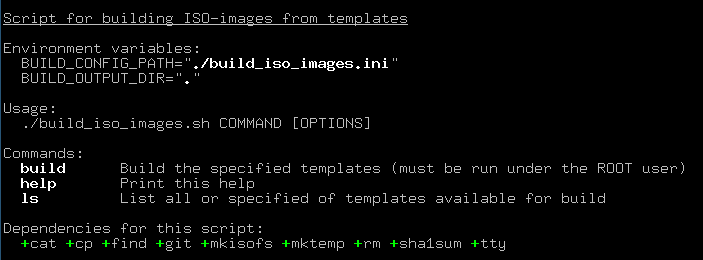
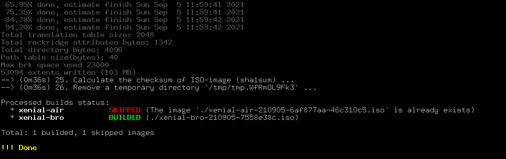

# build_iso_images.sh

### Содержание

* [Общая информация](#общая-информация)
* [Использование](#использование)
  * [Команда `ls`](#команда-ls)
  * [Команда `build`](#команда-build)
* [Конфигурация](#конфигурация)
* [Базовые слои](#базовые-слои)
* [Именование файлов базовых слоёв и ISO-образов](#именование-файлов-базовых-слоёв-и-iso-образов)
* [Специальный файл `.build_version`](#специальный-файл-build_version)

### Общая информация

Скрипт для создания `ISO`-образов (шаблонов) на основе которых потом и будут создаваться бездисковые виртуальные машины.
Каждый `ISO`-образ формируется по следующей схеме (в круглых скобках указаны необязательные этапы):

```
(сборка и упаковка артефакта базового слоя ОС при необходимости (если его нет))
-> распаковка артефакта с преподготовленным базовым слоем ОС
  -> (клонирование GIT-репозитария в базовый слой ОС)
    -> (запуск скрипта деплоя из репозитария)
      -> сборка ISO-образа
```

В итоге, с помощью различных репозитариев и скриптов деплоя можно на основе одного и того же базового слоя
собрать множество вариантов `ISO`-образов под конкретные задачи.

В скрипте реализована поддержка сборки нескольких образов за один проход. А результат их сборки отображается
в статусе в конце работы скрипта.

### Использование

Использование скрипта простое. Для вывода списка поддерживаемых комманд достаточно его просто запустить:



На этом экране скрипт также покажет используемые переменные окружения и их значения и список зависимостей
для корректной работы скрипта, при наличии их они отображаются с префиксом `+`.

Скрипт поддерживает следующие команды:
* **build** - Непосредственная сборка `ISO`-образов (поддерживается указание нескольких сборок за раз);
* **ls** - Вывод списка сборок, описанных в конфигурационном файле;

Для уточнения параметров любой команды, а также её опций достаточно её просто запустить.

##### Команда `ls`

Формат запуска:
```bash
$ ./build_iso_images.sh ls
```

Команда отображает 'виденье' конфигурационного файла скриптом. В скриншоте сборка `xenial-bro` основывается
только на базовом слое, без использования репозитария и скрипта деплоя (о структуре конфигурационного файла
смотрим ниже), поэтому их параметры не отображаются.

Выделение цветом значений параметров применяется для указания разницы с настройками по умолчанию.

##### Команда `build`

Формат запуска:
```bash
$ ./build_iso_images.sh build [OPTIONS] <build_name> [<build_name>] ...
$ ./build_iso_images.sh build [OPTIONS] all
```

Как видим, команда поддерживает в качестве параметров имена сборок, либо ключевое слово `all`, указывающее
на сборку всех описанных в конфигурационном файле `ISO`-образов.

Опции:
* **-f** - Повторная сборка `ISO`-образа, даже если он уже существует;

Для сборки `ISO`-образов требуются права `ROOT`-пользователя, поэтому рекомендуется использовать команду `sudo`.
В конце сборки команда отображает статус всех обработанных `ISO`-образов:



Как видим из скриншота, одна из сборок уже существовала и поэтому скрипт её пропустил, поэтому в большинстве
случаев достаточно запускать команду с параметром `all` и быть уверенным, что скрипт соберёт все актуальные версии
`ISO`-образы, а уже собранные пропустит.

```bash
$ sudo ./build_iso_images.sh build all
```

### Конфигурация

Конфигурация сборок указывается в `INI`-файле, расположение которого задаётся в переменной окружения `BUILD_CONFIG_PATH`.
В файле перечисляются все сборки, которые скрипт может собрать. Вот пример конфигурации из `.ini.example`:

```ini
[xenial-air]                               # The INI-section with build name
base_layer="ubuntu-xenial-amd64-minbase"   # The base layer in which the command specified
                                           # in 'run_from_repo' will be run and a finished ISO-image will be builded
repo_url="git@server:user/repo_name.git"   # The URL of repository with deploy script and required files
repo_clone_into="repo/"                    # Clone repository to specified path in resulted file tree
repo_checkout="master"                     # The branch/tag/commit of repository to used for checkout
repo_depth=1                               # The number of commits from the history that will be saved
run_from_repo="/deploy.sh"                 # The path in repository of deploy script to be runned

[xenial-bro]
base_layer="ubuntu-xenial-amd64-minbase"
```

Как и любой классический `INI`-файл конфигурация состоит из секций (заключенных в квадратные скобки) и параметров к ним.
Каждая `INI`-секция описывает одноименную сборку. В примере указаны сборки с названиями `xenial-air` и `xenial-bro`.

Обязательным параметром является только `base_layer`, указывающий на основе какого базового слоя ОС будет эта сборка.
Соответственно, если более не указать никаких параметров, то будет сборка только на основе базового слоя, ничем более
не модифицированная.

Параметры `repo_*` указывают настройки для `GIT`-репозитария, который клонируется в файловую систему будущего образа.
Соответственно, задаётся URL до репозитория, директория куда его клонировать внутри образа, название ветки и глубина
клонирования.

При указании `GIT`-репозитария, также можно указать путь до скрипта, который будет запущен в момент сборки образа.
С помощью такого скрипта можно привести базовый слой ОС к нужному состоянию (например, установить нужные пакеты,
записать подготовленные конфигурационные файлы и т.д.). Скрипт запускается в `chroot`-окружении файловой системы образа.

### Базовые слои

Базовые слои располагаются в папке `base_layers`. Каждый базовый слой представляет из себя скрипты для сборки
(формирования файловой системы) конкретной ОС, а также вспомогательные файлы (файлы конфигурации, преднастройки
для бездисковой работы).

Рассмотрим структуру на примере `ubuntu-xenial-amd64-minbase`:

```
├ etc/               - Вспомогательные файлы конфигурации для базовой настройки ОС (копируются с помощью .build.sh)
├ opt/               - Вспомогательные файлы конфигурации для базовой настройки ОС (копируются с помощью .build.sh)
├ .build.sh          - Основой скрипт для формирования файловой системы ОС базового слоя
├ .dependencies      - Список зависимостей для корректной работы основного скрипта
├ .pre_image.sh      - Дополнительный скрипт, подготавливающий файловую систему базового слоя к упаковке в ISO-образ
                       (удаление ненужных файлов, архивирование файловой системы, настройка загрузчика)
```

Скрипт `.build.sh` - основной и запускается самым первым, именно он должен сформировать файловую систему ОС будущего
базового слоя, также в этом скрипте рекомендуется производить базовую настройку ОС (копировать необходимые файлы
конфигурации).

После работы `.build.sh` скрипта сформированная и настроенная файловая система ОС архивируется для последующего
использования для сборки образов, т.е. фактически этот артефакт используется в качестве кеша, чтобы каждый раз
не пересобирать базовый слой.

**!!! Важно**, чтобы базовый слой отвечал требованиям повторяемых сборок, т.е. в нём не должны устанавливаться самые
последние версии пакетов, а должен использоваться один и тот же 'срез' набора пакетов.

При сборке очередного `ISO`-образа преподготовленный с помощью `.build.sh` скрипта артефакт базового слоя
распаковывается, при необходимости в него клонируется `GIT`-репозитарий и запускается скрипт деплоя. После чего
из папки с базовым слоем запускается `.pre_image.sh` скрипт, который готовит файловую систему к упаковке в `ISO`-образ.
Здесь происходит удаление ненужных файлов, архивирование файловой системы и настройка загрузчика.

Пример части работы скрипта (с перенаправлением `>/dev/null`) для показа очередности работы:
```
...
--> (0m1s) 11. Unarchive the base layer 'ubuntu-xenial-amd64-minbase' (tar) ...
--> (0m5s) 12. Clone the GIT-repo from '../../repos/air-workset-local' with depth 1 (git) ...
--> (0m7s) 13. Checkout the GIT-repo to 'master' commit/branch/tag (git) ...
--> (0m7s) 14. Get the hash of 'HEAD' reference of GIT-repo (git) ...
--> (0m7s) 15. Calculate the image version (sha1sum) ...
--> (0m7s) 16. Run the 'deploy/dpl-diskless.sh' script in chroot from GIT-repo ...
--> (5m7s) 17. Write a '.build_version' special file in chroot and build trees (cat/cp) ...
--> (5m7s) 18. Run the '.pre_image.sh' script from 'ubuntu-xenial-amd64-minbase' base layer ...
...
```

Такое разделение на `.build.sh` и `.pre_image.sh` скрипты понадобилось для корректных сборок, т.к. клонировать
`GIT`-репозитарий и запускать в нём скрипт деплоя нужно после сборки базовой слоя (`.build.sh`), но перед окончательной
подготовкой файловой системы к упаковке в `ISO`-образ (`.pre_image.sh`). Также это позволяет более эффективно
переиспользовать уже собранные артефакты базовых слоёв.

### Именование файлов базовых слоёв и ISO-образов

В именах файлов генерируемых артефактов базовых слоёв, а также самих `ISO`-образах используются `sha1`-хешсуммы,
которые высчитываются по содержимому, позволяя тем самым точно разделять разные сборки при изменении хотя бы одного
элемента внутри.

Наименование файлов с артефактами базовых слоёв:
```
ubuntu-xenial-amd64-minbase-2.210716-a346cd0e.tar.gz
^^^^^^^^^^^^^^^^^^^^^^^^^^^                          - Название базового слоя
                            ^^^^^^^^                 - Версия build_iso_images.sh скрипта
                                     ^^^^^^^^        - sha1-сумма от содержимого папки базового слоя
                                                       за исключением файлов .dependencies и .pre_image.sh
```

Из `sha1`-суммы исключаются файлы базового слоя `.dependencies` и `.pre_image.sh` для эффективной работы кеша, т.к.
при изменении их не требуется пересборка базового слоя, а требуется только пересборка конечного `ISO`-образа.

Наименование файлов с `ISO`-образами, основанных только на базовом слое:
```
xenial-bro-210807-474a293b.iso
^^^^^^^^^^                                           - Название сборки (из конфигурационного файла)
           ^^^^^^                                    - Дата сборки (в формате YYMMDD)
                  ^^^^^^^^                           - sha1-сумма от базового слоя и .pre_image.sh скрипта
```

"Дата сборки" в имени применяется не только для удобной сортировки `ISO`-образов, но и служит индикатором для
пересборки образа в другой день, т.к. скрипт не пересобирает уже собранные образы. Это актуально, когда установка
своего программного обеспечения идёт не через `GIT`-репозитарий со скриптом деплоя, а через стандартный пакетный
менеджер ОС. В этом случае ни базовый слой, ни `.pre_image.sh` скрипт, ни сам `GIT`-репозитарий, ни скрипт деплоя
не меняются и при использовании в имени файла `ISO`-образа только `sha1`-суммы (без даты сборки) генерировалось бы
всегда одно и тоже имя файла и скрипт пропускал бы такую сборку. В таких случаях дату сборку можно ещё и интерпретировать
как "дату среза" репозитария пакетного менеджера.

Наименование файлов с `ISO`-образами, основанных на базовом слое, `GIT`-репозитарии и скрипте деплоя:
```
xenial-air-210807-459bca12-474a293b.iso
^^^^^^^^^^                                           - Название сборки (из конфигурационного файла)
           ^^^^^^                                    - Дата сборки (в формате YYMMDD)
                  ^^^^^^^^                           - Срез (commit) GIT-репозитария
                           ^^^^^^^^                  - sha1-сумма от базового слоя, пути до скрипта деплоя и .pre_image.sh скрипта
```

Если `ISO`-образ основан не только на базовом слое, но и используется `GIT`-репозитарий со скриптом деплоя, то
в наименование файла добавляется хеш-сумма среза (коммита) `GIT`-репозитария. Она тоже служит индикатором для пересборки
`ISO`-образа при изменении среза `GIT`-репозитария.

### Специальный файл `.build_version`

В каждый собранный `ISO`-образ записывается специальный файл `.build_version` с информацией об источниках сборки.
Он располагается в корне `ISO`-образа, а также дублируется в корень файловой системы ОС.

Пример содержимого:
```ini
base_layer_tar_path="./ubuntu-xenial-amd64-minbase-2.210823-62afbbe0.tar.gz"
base_layer_pre_image_script_path="./base_layers/ubuntu-xenial-amd64-minbase/.pre_image.sh"
base_layer_pre_image_hash="21a4ab8c"
image_version_source="ubuntu-xenial-amd64-minbase-2.210823-62afbbe0.tar.gz-deploy/dpl-diskless.sh-21a4ab8c"
image_version="46c310c5"
image_path="./xenial-air-210905-6af877aa-46c310c5.iso"
repo_url="../../repos/air-workset-local"
repo_checkout="master"
repo_clone_into="opt/distr/"
repo_head_short_hash="6af877aa"
run_from_repo="deploy/dpl-diskless.sh"
```

Расшифровка параметров:
| Имя параметра | Описание параметра | Дублируется из конфигурационного файла |
| ------------- | ------------------ | :------------------------------------: |
| **base_layer_tar_path** | Путь до артефакта (архива) базового слоя, на котором основан этот `ISO`-образ |
| **base_layer_pre_image_script_path** | Путь до `.pre_image.sh` скрипта из базового слоя |
| **base_layer_pre_image_hash** | `sha1`-сумма от содержимого `.pre_image.sh` скрипта (используется далее) |
| **image_version_source** | Исходная строка для вычисления версии `ISO`-образа: ${base_layer_tar_path}-${run_from_repo}-${base_layer_pre_image_hash} |
| **image_version** | Версия `ISO`-образа, фактически `sha1`-сумма от `image_version_source` |
| **image_path** | Путь до собранного `ISO`-образа на машине, где он собирался |
| **repo_url** | Путь до `GIT`-репозитария | + |
| **repo_checkout** | Ревизия/ветка на которую надо переключиться после клонирования `GIT`-репозитария | + |
| **repo_clone_into** | Папка в которую надо склонировать `GIT`-репозитарий | + |
| **repo_head_short_hash** | Хеш-сумма среза (коммита) после переключения на `repo_checkout` ревизию/ветку |
| **run_from_repo** | Путь до скрипта деплоя в `GIT`-репозитарии | + |
