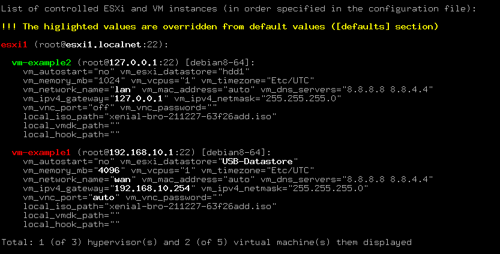
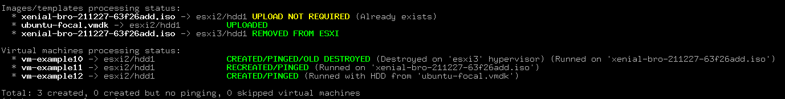
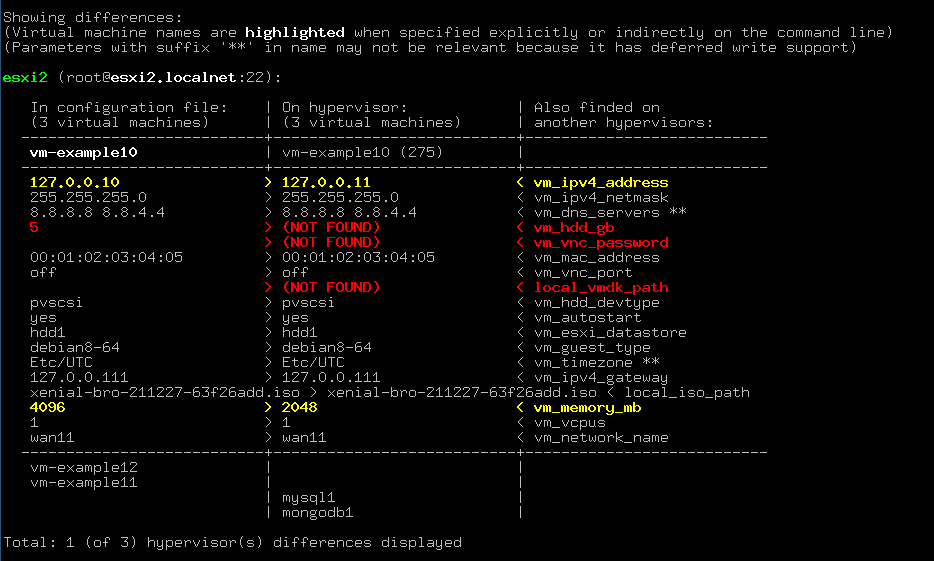

# control_vm_esxi.sh

### Содержание

* [Общая информация](#общая-информация)
* [Использование](#использование)
  * [Команда `ls`](#команда-ls)
  * [Команда `create`](#команда-create)
  * [Команда `destroy`](#команда-destroy)
  * [Команда `reboot`](#команда-reboot)
  * [Команда `show`](#команда-show)
  * [Команда `update`](#команда-update)
  * [Команда `upload`](#команда-upload)
* [Конфигурация](#конфигурация)
* [Кеширование](#кеширование)
* [Типы исключений](#типы-исключений)
* [Хуки](#хуки)

### Общая информация

Скрипт простого управления (без)дисковыми виртуальными машинами на `VmWare ESXi` гипервизоре: умеет создавать,
уничтожать, перезагружать, обновлять параметры на лету и показывать разницу между конфигурацией и реальным положением
дел на гипервизоре.

Скрипт работает по следующему алгоритму (в круглых скобках указаны необязательные этапы, всё зависит от команды):

```
подготовительные этапы (проверка зависимостей, парсинг конфигурационного файла и т.д.)
-> (подготовка карты виртуальных машин/настроек автостарта/карты хранилищ на всех или выборочных гипервизорах)
  -> (предварительное копирование необходимых ISO-образов и HDD-шаблонов на гипервизоры)
    -> работа указанной команды для одной или нескольких виртуальных машин
      -> (удаление неиспользуемых более ISO-образов и HDD-шаблонов на гипервизорах)
        -> вывод статуса обработанных ISO-образов c HDD-шаблонами (при необходимости) и виртуальных машин
```

В скрипте реализована поддержка последовательной обработки нескольких виртуальных машин за один проход.
А результат их обработки отображается в статусе в конце работы скрипта.

Взаимодействие с гипервизорами происходит по `SSH`-протоколу и посредством `API` (через программу `govc`).
Взаимодействие посредством `API` потребовалось команде `update` для горячей замены `ISO`-образов и обновления других
параметров виртуальных машин. В будущем планируется использовать только один вид взаимодействия.

### Использование

Использование скрипта простое. Для вывода списка поддерживаемых комманд достаточно его просто запустить:


На этом экране скрипт также покажет используемые переменные окружения и их значения и список зависимостей
для корректной работы скрипта, при наличии их они отображаются с префиксом `+`.

Скрипт поддерживает следующие команды:
* **create** - Создание и запуск виртуальных машин;
* **destroy** - Остановка и уничтожение виртуальных машин;
* **ls** - Вывод списка всех контролируемых виртуальных машин и гипервизоров, описанных в конфигурационном файле;
* **reboot** - Перезагрузка или рестарт виртуальных машин;
* **show** - Вывод разницы конфигурации виртуальных машин между гипервизором и конфигурационным файлом;
* **update** - Обновление настроек виртуальных машин на лету;
* **upload** - Предварительная загрузка `ISO`-образов и `HDD`-шаблонов на гипервизоры;

Для уточнения параметров любой команды, а также её опций достаточно её просто запустить.

##### Команда `ls`

Команда отображает 'виденье' конфигурационного файла скриптом. Формат запуска:
```bash
$ ./control_vm_esxi.sh ls [options] <vm_name> [<esxi_name>] [<vm_name>] ...
$ ./control_vm_esxi.sh ls [options] all
```

В качестве параметров команда принимает имена виртуальных машин и гипервизоров, а также ключевое слово `all`,
указывающее на вывод всех определенных в конфигурационном файле виртуальных машин и гипервизоров. При указании
в качестве параметра имени гипервизора будут показаны все виртуальные машины на этом гипервизоре.

Опции:
* **-n** - Не проверять доступность виртуальных машин с помощью `ping`;

По умолчанию команда проверяет доступность виртуальных машин простым `ping`'ом и помечает зеленым цветом машины,
до которых связь имеется и красным - до которых связи нет.

Выделение цветом значений параметров применяется для указания разницы с настройками по умолчанию.



В конце указывается количество показанных виртуальных машин и гипервизоров, против количества всех виртуальных
машин и гипервизоров, указанных в конфигурационном файле.

##### Команда `create`

Команда для создания и запуска виртуальных машин. Формат запуска:
```bash
$ ./control_vm_esxi.sh create [options] <vm_name> [<esxi_name>] [<vm_name>] ...
```

В качестве параметров команда принимает имена виртуальных машин и гипервизоров. Если указать в качестве параметра
имя гипервизора, то будут созданы все описанные в конфигурационном файле виртуальные машины на нём.

Опции:
* **-d** - Уничтожит одноименную виртуальную машину, найденную на другом гипервизоре (аналог миграции);
* **-da** - Автоматически не включать менеджер автостарта виртуальных машин на гипервизорах;
* **-ed** - Разрешить уничтожение виртуальных машин с `HDD`-дисками, по умолчанию запрещено;
* **-f** - Пересоздаст (уничтожит и создаст заново) виртуальную машину, если она уже имеется на гипервизоре;
* **-ff** - Перепроверить контрольные суммы для `ISO`-образов и `HDD`-шаблонов, которые уже имеются на гипервизоре;
* **-fs** - Принудительно выключит виртуальную машину (при использовании опций `-d` и/или `-f`), если пакет `vmware-tools` не запущен;
* **-i** - Игнорирование гипервизоров, к которым не удалось подключиться при построении карты виртуальных машин;
* **-n** - Не строить полную карту виртуальных машин на всех гипервизорах, ограничиться только нужными;
* **-sn** - Игнорировать проверку сетевых настроек виртуальной машины (например, для случаев когда шлюз находится за пределами сети);
* **-sr** - Пропустить автоматическое удаление неиспользуемых `ISO`-образов и `HDD`-шаблонов с гипервизоров (при использовании опций `-d` и/или `-f`);
* **-t** - Верить `.sha1` файлам (по умолчанию скрипт перепроверяет их для надёжности);

Поскольку в скрипте реализовано построение карты виртуальных машин на всех гипервизорах, скрипт имеет возможность
найти создаваемую машину на других гипервизорах и предупредить об этом пользователя.


Однако с помощью опции **-d** можно указать скрипту на "миграцию" этой виртуальной машины с другого гипервизора
(только в том случае, если одноимённая виртуальная машина была обнаружена на единственном другом гипервизоре,
иначе, если она была обнаружена на нескольких гипервизорах, то скрипту невозможно понять откуда именно её нужно мигрировать).
Скрипт остановит виртуальную машину на другом гипервизоре и создаст её на требуемом. В случае каких-либо ошибок
скрипт вернет всё обратно. А в случае успешного исхода уничтожит виртуальную машину на старом гипервизоре.

Опция **-da** запрещает включать менеджер автостарта виртуальных машин на гипервизорах, если он отключен, но
необходим по настройкам виртуальных машин. Вместо этого скрипт просто возвратит ошибку с указанием необходимости
включения менеджера автостарта виртуальных машин в ручном режиме.

Опция **-ed** разрешает уничтожать виртуальные машины с `HDD`-дисками (при миграции или пересоздании),
операция запрещена по умолчанию, т.к. является необратимой и есть риск потери данных.

Опция **-f** позволяет пересоздать заново виртуальную машину, например, в случаях когда требуется обновить такие параметры,
которые не поддерживает команда **update**.

Опция **-ff** позволяет принудительно перепроверить контрольные суммы, а значит и бинарное равенство локальных
`ISO`-образов и `HDD`-шаблонов с `ISO`-образами и `HDD`-шаблонами на гипервизорах, которые скрипт собирался загружать,
но обнаружил их присутствие там.

С опцией **-fs** скрипт принудительно выключит виртуальную машину, даже если пакет `vmware-tools` не запущен.
По умолчанию скрипт вытается посылать команду `shutdown` для корректного выключения виртуальной машины, однако
это бывает невозможно сделать, если пакет `vmware-tools` не установлен. Опция актуальна только при использовании с
опциями **-d** или **-f**, когда применяется операция выключения виртуальной машины.

Опции **-i** и **-n** управляют построением карты виртуальных машин на гипервизорах. По умолчанию скрипт пытается
соединиться с каждым гипервизором, указанным в конфигурационном файле и при невозможности подключения к любому из них
прекращает свою работу, т.к. в этом случае невозможно построить полную карту. Для игнорирования таких ситуаций
пригодится опция **-i**, которая указывают скрипту продолжать работу даже при невозможности подключения ко всем
гипервизорам. Следует понимать, что в этом случае карта будет не полная и, соответственно, скрипт не сможет
выдать полноценную информацию по альтернативному расположению виртуальных машин. Опция **-n** указывает скрипту
строить карту только на необходимых гипервизорах, например, при команде **create** с этой опцией карта будет
строиться только на том же гипервизоре и где и будет размещаться новая виртуальная машина.

По умолчанию скрипт проверяет все указанные параметры в конфигурационном файле, в том числе и сетевые настройки
виртуальных машин. Бывают ситуации когда шлюз по умолчанию находится за пределами сети (опция `link` в `ip route`)
и в этом случае проверка не пройдет. Для игнорирования таких ситуаций можно использовать опцию **-sn**;

Опция **-sr** позволит пропустить автоматическое удаление неиспользуемых более `ISO`-образов и `HDD`-шаблонов с
гипервизоров. Это операция запускается в самом конце и удаляет образы, которые не используются более ни одной
виртуальной машиной, чтобы сохранить место под будущие образы.

И, наконец, опция **-t** позволяет немного убыстрить работу скрипта доверяя `.sha1` файлам,
т.к. по умолчанию скрипт, даже при наличии этих файлов, перепроверяет контрольные суммы, для надежности.

В конце своей работы команда отображает статус всех созданных виртуальных машин. Рассмотрим на примере, была
запущена следующая команда:

```bash
$ ./control_vm_esxi.sh -d -f vm-example10 vm-example11 vm-example12
```



Как видим из скриншота, загрузка `ISO`-образа на `esxi2`-гипервизор не понадобилась, т.к. образ уже там существовал,
`HDD`-шаблон был загружен, т.к. осутствовал на гипервизоре, `ISO`-образ был удален на `esxi3`-гипервизор, т.к. более
там не нужен, виртуальная машина `vm-example10` были мигрирована с `esxi3`-гипервизора (указан опция `-d`),
машина `vm-example11` была пересоздана, т.к. уже существовала на гипервизоре(опция `-f`), а `vm-example12` была
просто создана. Также ключевое слово `PINGED`, говорит о том, что каждая из трёх созданных машин была доступна с места,
где был запущен скрипт.

##### Команда `destroy`

Команда для остановки и уничтожения виртуальных машин, в том числе и тех, которые не указаны в конфигурационном файле.
Формат запуска:
```bash
$ ./control_vm_esxi.sh destroy [options] <vm_name> [vm_name] [<esxi_name>/<vm_name>] ...
```

В качестве параметров команда принимает имена только виртуальных машин, имена гипервизоров здесь указать нельзя,
для безопасности. Также, если указать префиксом название конкретного гипервизора, то скрипт сможет уничтожить
виртуальную машину, которая не указана в конфигурационном файле.

Опции:
* **-ed** - Разрешить уничтожение виртуальных машин с `HDD`-дисками, по умолчанию запрещено;
* **-fs** - Принудительно выключит виртуальную машину, если пакет `vmware-tools` не запущен;
* **-sr** - Пропустить автоматическое удаление неиспользуемых `ISO`-образов и `HDD`-шаблонов с гипервизоров;

Все поддерживаемые опции были рассмотрены в секции по [команде **create**](#команда-create).

##### Команда `reboot`

Команда для перезагрузки виртуальных машин, в том числе и тех, которые не указаны в конфигурационном файле.
Формат запуска:
```bash
$ ./control_vm_esxi.sh reboot [options] <vm_name> [vm_name] [<esxi_name>/<vm_name>] ...
```

Также, как и команда **destroy**, в качестве параметров принимаются имена только виртуальных машин, имена гипервизоров
здесь указать нельзя, для безопасности. Если префиксом указать название конкретного гипервизора, то скрипт сможет перезагрузить
виртуальную машину, которая не указана в конфигурационном файле.

Опции:
* **-fr** - Принудительно перезагрузить виртуальную машину, если пакет `vmware-tools` не запущен;

По умолчанию скрипт посылает сигнал `reboot` виртуальной машине, т.е. пытается её перезагрузить безопасным методом.
Однако если пакет `vmware-tools` не установлен, то гипервизор не сможет этого сделать. Для таких ситуаций опция **-fr**
позволит перезагрузить машину, послав команду `reset`, однако это способ не безопасный, т.к. программы на виртуальной
машине завершат свою работу не корректным способом.

##### Команда `show`

Команда показывает состояние виртуальных машин в конфигурационном файле и на гипервизорах, а также разницу настроек в
них. Формат запуска:
```bash
$ ./control_vm_esxi.sh show [options] <esxi_name> [<vm_name>] [<esxi_name>] ...
```

В качестве параметров команда принимает имена виртуальных машин и гипервизоров. И хотя команда в качестве параметров
принимает имена виртуальных машин, по факту она всегда показывает состояние для всего гипервизора. Разница лишь в том,
для каких виртуальных машин скрипт покажет ещё и разницу в настройках.

Опции:
* **-i** - Игнорирование гипервизоров, с которыми не удалось подключиться при построении карты виртуальных машин;
* **-n** - Не строить полную карту виртуальных машин на всех гипервизорах, ограничиться только нужными;

Все поддерживаемые опции были рассмотрены в секции по [команде **create**](#команда-create).

Теперь рассмотрим работу этой команды, она была вызвана следующим образом:

```sh
$ ./control_vm_esxi.sh show vm-example10
```



Для каждого гипервизора команда отображает 3 колонки. В первой колонке отображаются виртуальные машины, описанные
для этого гипервизора в конфигурационном файле, во второй колонке - виртуальные машины, найденные на самом гипервизоре,
а в третьей отображаются наименования настроек, либо имена гипервизоров, где виртуальные машины встречаются ещё.

Поскольку в качестве параметра мы указали виртуальную машину под именем `vm-example10` и она встречается,
как в конфигурационном файле, так и на гипервизоре, то скрипт её выделяет цветом и показывает все её настройки,
как в конфигурационном файле, так и на гипервизоре. Причем отличающиеся значения помечаются желтым цветом.
Настройки, которые не были найдены на гипервизоре отображаются красным цветом.

Ниже в колонках отображаются виртуальные машины, которые встречаются только в конфигурационном файле или только
на гипервизоре. Однако, как видим, виртуальная машина с именем `vm-example11` встречается и там и там, но скрипт
не показал её настройки, потому что в качестве параметров мы указали только `vm-example10` машину и скрипт показал
разницу в настройках только для неё.

Также можно заметить, что виртуальные машины `mysql1` и `mongodb1` существующие только на гипервизоре были
обнаружены скриптом ещё и на другом гипервизоре под названием `esxi3`.

Тем самым команда позволяет очень простым способом смотреть актуальное состояние виртуальных машин в конфигурационном
файле и на самих гипервизорах.

##### Команда `update`

Команда для обновления настроек виртуальных машин. Формат запуска:
```bash
$ ./control_vm_esxi.sh update <parameter_name> [options] <vm_name> [<esxi_name>] [<vm_name>] ...
```

В качестве параметров команда принимает имена виртуальных машин и гипервизоров. Если указать в качестве параметра
имя гипервизора, то настройки будут обновлены для всех виртуальных машин на этом гипервизоре.

Опции:
* **-ff** - Перепроверить контрольные суммы для `ISO`-образов и `HDD`-шаблонов, которые уже имеются на гипервизоре;
* **-i** - Игнорирование гипервизоров, с которыми не удалось подключиться при построении карты виртуальных машин;
* **-n** - Не строить полную карту виртуальных машин на всех гипервизорах, ограничиться только нужными;
* **-sn** - Игнорировать проверку сетевых настроек виртуальной машины (для случаев когда шлюз находится за пределами сети);
* **-sr** - Пропустить автоматическое удаление неиспользуемых `ISO`-образов и `HDD`-шаблонов с гипервизоров;
* **-t** - Верить `.sha1` файлам (по умолчанию скрипт перепроверяет их)

Все поддерживаемые опции были рассмотрены в секции по [команде **create**](#команда-create).

На данный момент команда умеет обновлять значения следующих параметров - `local_iso_path`, `vm_dns_servers`,
`vm_timezone`. Все параметры обновляются на "горячую", т.е. меняют свои значения сразу же, но только в конфигурации
гипервизора. Поэтому, чтобы обновленные значения подхватились самими виртуальными машинами необходима их перезагрузка.

**!!! Важно**, чтобы базовый слой, на основе которого работает виртуальная машина имел поддержку извлечения
`ISO`-образа из виртуального CD-ROM через `vmware-tools`. Сейчас скрипт посылает команду `eject` через гипервизор
на виртуальную машину через `vmware-tools` под `nobody`-пользователем. Важно, чтобы у пользователя `nobody` была
возможность безпарольной авторизации через `vmware-tools`. Как правило, для этого достаточно добавить такое PAM-правило:

```diff
--- /etc/pam.d/vmtoolsd  2021-09-06 19:08:20.759263150 +0400
+++ /etc/pam.d/vmtoolsd  2021-08-23 17:44:29.474731215 +0400
@@ -1,4 +1,7 @@
 #%PAM-1.0

+auth [success=ok default=1] pam_succeed_if.so quiet user = nobody
+auth [success=done default=ignore] pam_permit.so
+
 @include common-auth
 @include common-account
```

Все базовые слои в составе этого репозитария поддерживают эту возможность.

##### Команда `upload`

Команда для предварительной загрузки `ISO`-образов и `HDD`-шаблонов на гипервизоры. Формат запуска:
```bash
$ ./control_vm_esxi.sh upload [options] <vm_name> [<esxi_name>] [<vm_name>] ...
$ ./control_vm_esxi.sh upload [options] all
```

В качестве параметров команда принимает имена виртуальных машин и гипервизоров. При указании в качестве параметра
имени виртуальной машины, скрипт загрузит необходимый `ISO`-образ и/или `HDD`-шаблон только для неё, в случае
указания имени гипервизора - скрипт загрузит необходимые `ISO`-образы и/или `HDD`-шаблоны для всех виртуальных машин,
описанных для него в конфигурационном файле. А при указании ключевого слова `all` - загрузит необходимые `ISO`-образы
и `HDD`-шаблоны для всех виртуальных машин на всех гипервизорах.

Опции:
* **-ff** - Перепроверить контрольные суммы для `ISO`-образов и `HDD`-шаблонов, которые уже имеются на гипервизоре;
* **-t** - Верить `.sha1` файлам (по умолчанию скрипт перепроверяет их)

Все поддерживаемые опции были рассмотрены в секции по [команде **create**](#команда-create).

В процессе работы многих команд (`create`, `update`) скрипт также предварительно загружает необходимые `ISO`-образы
и `HDD`-шаблоны на гипервизоры. Команда **upload** позволяет запустить этот процесс в нужное время, тем самым хоть
команда и повторяет функциональность, но создана для удобства (особенно с параметром `all`), чтобы заранее, а не
в момент создания виртуальных машин загрузить для них все необходимые образы.

Ниже представлен пример работы с параметром `all`:

```bash
$ ./control_vm_esxi.sh upload all
```


### Конфигурация

Конфигурация виртуальных машин и гипервизоров указывается в `INI`-файле, расположение которого задаётся в переменной
окружения `ESXI_CONFIG_PATH`. В файле перечисляются все виртуальные машины и гипервизоры, с которыми скрипт может
взаимодействовать. Вот пример конфигурации из `.ini.example`:

```ini
[defaults]
#esxi_hostname=""                  # REQUIRED
#esxi_ssh_password=""
#esxi_ssh_port=22
#esxi_ssh_username="root"
#local_hook_path=""
#local_iso_path=""
#local_vmdk_path=""
#vm_autostart="no"
#vm_dns_servers="8.8.8.8 8.8.4.4"  # Separated by spaces
#vm_esxi_datastore="datastore1"
#vm_hdd_devtype="pvscsi"
#vm_hdd_gb="5"
#vm_guest_type="debian8-64"
#vm_ipv4_address=""                # REQUIRED
#vm_ipv4_netmask="255.255.255.0"
#vm_ipv4_gateway=""                # REQUIRED
#vm_mac_address="auto"
#vm_memory_mb=1024
#vm_network_name="VM Network"
#vm_ssh_password=""
#vm_ssh_port=22
#vm_ssh_username="root"
#vm_timezone="Etc/UTC"
#vm_vcpus=1

local_iso_path=xenial-bro-211227-63f26add.iso
vm_esxi_datastore=hdd1
vm_ipv4_gateway=127.0.0.1
vm_network_name="wan"

[esxi_list]
esxi2 \
  esxi_hostname="esxi2.localnet" \
  esxi_ssh_password="password2"
esxi3 \
  esxi_hostname="esxi3.localnet" \
  esxi_ssh_password="password3" \
  vm_memory_mb=2048

[vm_list]
vm-example10 at="esxi2" \
  vm_autostart="yes" \
  vm_ipv4_address="127.0.0.11" \
  vm_memory_mb=2048

vm1-example11 at="esxi3" vm_ipv4_address="127.0.0.12"

vm-example12 at="esxi2" \
  vm_autostart="yes" \
  vm_ipv4_address="127.0.0.13" \
  vm_memory_mb=1024 \
  local_iso_path="" \
  local_vmdk_path="ubuntu-focal.vmdk" \
  vm_hdd_gb="10"
```

Как и любой классический `INI`-файл конфигурация состоит из секций (заключенных в квадратные скобки) и параметров к ним.
В конфигурационном файле должны обязательно присутствовать 3 секции в следующем порядке:

* **[defaults]** - Секция настроек по умолчанию;
* **[esxi_list]** - Секция определения и настроек гипервизоров;
* **[vm_list]** - Секция определения и настроек виртуальных машин;

В отличие от секции **[defaults]**, в которой задаются только параметры и их значения, в остальных секциях задаются
ресурсы и их параметры со значениями, где каждый ресурс - это имя гипервизора или виртуальной машины. Это и отличает
этот конфигурационной файл от классического `INI`-файла.

Скрипт поддерживает переопределение значений параметров в каждой из секции, т.е. значения по умолчанию можно
переопределить в секции настроек гипервизоров, а определённые там можно переопределить в секции настроек виртуальных
машин. Значения по умолчанию в самом скрипте указаны в `.ini.example` файле закоментированными.

Как видим из примера, в конфигурационном файле задаются 2 гипервизора с именами `esxi2` и `esxi3`, и 3 виртуальных
машины на них: `vm-example10`, `vm-example11`, `vm-example12`.

Общие для всех параметры задаются в секции **[defaults]**, и потом переопределяются по мере необходимости.
Виденье конфигурации скриптом можно посмотреть по команде [ls](#команда-ls).

Все параметры условно можно разделить на 3 группы: `esxi_` - настройки для доступа к гипервизору, `local_` - локальные
пути до вспомогательных файлов, `vm_` - настройки виртуальных машин.

Описание параметров:
| Имя параметра | Описание параметра | Значение по умолчанию |
| ------------- | ------------------ | :-------------------: |
| **esxi_hostname** | Адрес гипервизора | ОБЯЗАТЕЛЬНЫЙ |
| **esxi_ssh_password** | SSH-пароль для доступа к гипервизору | |
| **esxi_ssh_port** | SSH-порт для доступа к гипервизору | 22 |
| **esxi_ssh_username** | SSH-пользователь для доступа к гипервизору | root |
| **local_hook_path** | Локальный путь до хука или директории с хуками | |
| **local_iso_path** | Локальный путь до `ISO`-образа виртуальной машины | |
| **local_vmdk_path** | Локальный путь до `HDD`-шаблона виртуальной машины | |
| **vm_autostart** | Пометить виртуальную машину на автозагрузку вместе с гипервизором | нет |
| **vm_dns_servers** | Адреса DNS-серверов | 8.8.8.8 8.8.4.4 |
| **vm_esxi_datastore** | Имя хранилища где будет расположена виртуальная машина и `ISO`-образ к ней | datastore1 |
| **vm_guest_type** | Тип виртуальной машины | debian8-64 |
| **vm_hdd_devtype** | Тип адаптера `HDD`-накопителя | pvscsi |
| **vm_hdd_gb** | Необходимый размер `HDD`-накопителя | 5 |
| **vm_ipv4_address** | IPv4-адрес для виртуальной машины | ОБЯЗАТЕЛЬНЫЙ |
| **vm_ipv4_netmask** | IPv4-маска для виртуальной машины | 255.255.255.0 |
| **vm_ipv4_gateway** | IPv4-шлюз для виртуальной машины | ОБЯЗАТЕЛЬНЫЙ |
| **vm_mac_address** | MAC-адрес для виртуальной машины | auto |
| **vm_memory_mb** | Количество оперативной памяти для виртуальной машины в мегабайтах | 1024 |
| **vm_network_name** | Имя сети на гипервизоре, к которой будет подключена виртуальная машина | VM Network |
| **vm_ssh_password** | SSH-пароль для доступа к виртуальной машине | |
| **vm_ssh_port** | SSH-порт для доступа к виртуальной машине | 22 |
| **vm_ssh_username** | SSH-пользователь для доступк к виртуальной машине | root |
| **vm_timezone** | Временная зона виртуальной машины | Etc/UTC |
| **vm_vcpus** | Количество виртуальных процессоров для виртуальной машины | 1 |

Параметры **vm_ssh_** сейчас используются только при вызове [хук-скриптов](#хуки), больше нигде. В будущем их планируется
полностью удалить.

Скрипт парсит конфигурационный файл и проверяет на корректность, поэтому при любой ошибке укажет об этом:


### Кеширование

Для более быстрой работы скрипта при построении карты расположения виртуальных машин реализовано кеширование ответов
гипервизоров. Кеширование происходит в обычные файлы и настраивается следующими переменными окружения:

* **CACHE_DIR**="./.cache"
* **CACHE_VALID**="3600"

Время в течении которого кеш считается актуальным задаётся в секундах и по умолчанию равен 1 часу. По умолчанию
скрипт располагает кешированные ответы в **.cache/** директорию того места, откуда был запущен скрипт.

Для временного отключения кеширования можно использовать специальный символ `-`, например запустив так:

```bash
$ CACHE_DIR="-" ./control_vm_esxi.sh create vm-example10
```

Технически файлы кеша всё равно будут записываться, но уже во временную папку, которая меняется при каждом запуске,
т.е. фактически кеширование работать не будет, однако сохраненные файлы упростят отладку.

### Типы исключений

Скрипт работает с 3-мя типами сущностей - гипервизорами, образами/шаблонами и виртуальными машинами.
Поэтому для более удобной отладки было внедрено типизирование исключений по сущностям.

Рассмотрим пример, скрипт был запущен следующей командой:

```bash
$ ./control_vm_esxi.sh create vm-example10
```


Видим, что в процессе построения карты виртуальных машин случилась ошибка, а именно ошибка парсинга: скрипт не смог
распознать ответ гипервизора (в данном примере закешированный ответ) и выдал исключение `SKIPPING ESXI`, т.к.
это исключение относится ко всему гипервизору и дальнейшее взаимодействие с ним невозможно, о чём мы и видим в
статусе обработанных образов/шаблонов и виртуальных машин. Там также указан тип `SKIPPED ESXI`, т.е. пропуск произошёл
из-за проблем на гипервизоре, а не вследствии ошибок при работе с самими образами/шаблонами или виртуальными машинами.


Во втором примере мы видим ошибку с `ISO`-образом, а именно несоответствие подсчитанной контрольной суммы и в `.sha1`
файле, из-за чего получили исключение типа `SKIPPED IMAGE`, а далее виртуальная машина не могла быть создана,
т.к. `ISO`-образ не удалось залить/проверить, из-за чего возникло исключение типа `SKIPPED VM`.

### Хуки

После некоторых операций (`create`, `destroy`, `restart`) скрипт умеет запускать произвольные скрипты (хуки) для
каких-либо до-настроек (например, регистрация DNS-записи, настройка балансировщика и т.д.). Путь до хук-скриптов
указывается параметром `local_hook_path`, в котором можно указать как путь до конкретного исполняемого скрипта,
так и до директории со скриптами, которые будут выполнены в алфавитном порядке.
Скрипту передаются следующие переменные окружения:

| Имя переменной | Описание переменной | Копия параметра |
| -------------- | ------------------- | --------------- |
| **ESXI_NAME** | Имя гипервизора в конфигурационном файле | |
| **ESXI_HOSTNAME** | Адрес гипервизора | `esxi_hostname` |
| **STATUS** | Статус операции | |
| **STATUS_DESCRIPTION** | Дополнительная информация по статусу операции | |
| **TYPE** | Тип операции, из которой хук-скрипт был вызван (сейчас поддерживаются: `create`, `destroy`, `restart`) | |
| **VM_IPV4_ADDRESS** | Адрес виртуальной машины | `vm_ipv4_address` |
| **VM_SSH_PASSWORD** | SSH-пароль для доступа к виртуальной машине | `vm_ssh_password` |
| **VM_SSH_PORT** | SSH-порт для доступа к виртуальной машине | `vm_ssh_port` |
| **VM_SSH_USERNAME** | SSH-пользователь для доступа к виртуальной машине | `vm_ssh_username` |
| **VM_NAME** | Имя виртуальной машины в конфигурационном файле | |

Переменная **STATUS** может принимать следующие значения:

| Значение | Описание значения |
| -------- | ----------------- |
| ABORTED | Операция была прервана по серъезной ошибке или по требованию пользователя |
| CREATED/NO PINGING | Виртуальная машина создана, но не доступна по сети |
| CREATED/PINGING | Виртуальная машина создана и доступна по сети |
| CREATED/PINGING/OLD DESTROYED | Виртуальная машина создана, доступна по сети, старый инстанс уничтожен (была включена опция `-d`) |
| CREATED/PINGING/NOT OLD DESTROYED | Виртуальная машина создана, доступна по сети, но есть проблема с уничтожением старого инстанса (была включена опция `-d`) |
| DESTROYED | Виртуальная машина уничтожена |
| REBOOTED/NO PINGING | Виртуальная машина перезагружена, но не доступна по сети |
| REBOOTED/PINGING | Виртуальная машина перезагружена и доступна по сети |
| RECREATED/NO PINGING | Виртуальная машина пересоздана, но не доступна по сети |
| RECREATED/PINGING | Виртуальная машина пересоздана и доступна по сети |
| RECREATED/PINGING/OLD DESTROYED | Виртуальная машина пересоздана, доступна по сети, старый инстанс уничтожен (была включена опция `-d`) |
| RECREATED/PINGING/NOT OLD DESTROYED | Виртуальная машина пересоздана, доступна по сети, но есть проблема с уничтожением старого инстанса (была включена опция `-d`) |
| REGISTERED/OLD REVERTED | Виртуальная машина была создана, но не доступна по сети, поэтому старый инстанс был возвращен, а новый выключен (была включена опция `-d`) |
| SKIPPED ESXI | Все виртуальные машины на гипервизоре были пропущены из-за какой-либо ошибки |
| SKIPPED VM | Виртуальная машина была пропущена из-за какой-либо ошибки |

Подробное описание ошибки будет доступно через переменную окружения **STATUS_DESCRIPTION**.

Если скрипт (если в `local_hook_path` указан путь до конкретного исполняемого файла) или все скрипты в директории
(если указан путь до директории) успешно отрабатывают, то в статусе обработанных виртуальных машин появится маркер
**HOOK RUNNED**, в противном случае **HOOK FAILED**.
